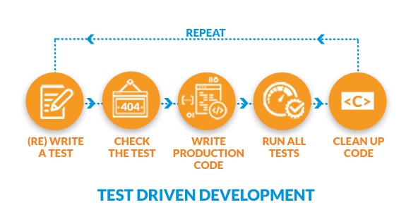

# Test Driven Development | Jest

Test-driven development (TDD) is a software development process relying on software requirements being converted to test cases before software is fully developed, and tracking all software development by repeatedly testing the software against all test cases.

## TDD Algorithm

## Jest

Jest is a JavaScript testing framework designed to ensure correctness of any JavaScript codebase.
[Jest](https://jestjs.io/)
